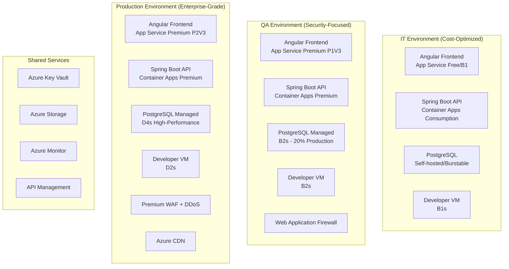

# BeeInfra - Azure Infrastructure as Code

## 🎯 Project Overview

**BeeInfra** is a comprehensive Azure infrastructure setup designed for a typical web application with Angular frontend, REST APIs, and PostgreSQL database. This project provides Infrastructure as Code (IaC) templates and automation scripts for deploying across three environments: **IT**, **QA**, and **Production**.

## 🏗️ Architecture



## 📋 Requirements Compliance

This infrastructure implements all requirements from `infrasetup.instructions.md`:

### 🔧 Environment Setup (Requirements 1-3)
- ✅ **IT Environment**: Free tier priority, cost-optimized resources
- ✅ **QA Environment**: Security-focused, 20% of production capacity  
- ✅ **Production Environment**: Enterprise-grade, high availability

### 💰 Cost Management (Requirements 4-11)
- ✅ **Budget Alerts**: $10 (IT), $20 (QA), $30 (Production)
- ✅ **Dual Monitoring**: Both estimated and actual cost alerts
- ✅ **Auto-shutdown**: 1-hour idle detection across all environments
- ✅ **Email Notifications**: prashantmdesai@yahoo.com, prashantmdesai@hotmail.com
- ✅ **SMS Alerts**: +1 224 656 4855

### 🔒 Security (Requirements 12-23)
- ✅ **Azure Key Vault**: All secrets management
- ✅ **HTTPS Enforcement**: All web traffic over HTTPS
- ✅ **Managed Identities**: No hardcoded credentials
- ✅ **WAF Protection**: Web Application Firewall in QA/Production
- ✅ **Private Endpoints**: Database and storage isolation

### 🖥️ Developer Access (Requirements 24-25)
- ✅ **Linux VMs**: One per environment with pre-installed tools
- ✅ **Tool Installation**: Azure CLI, GitHub CLI, Git, Docker, VS Code Server
- ✅ **Public IP Display**: Shown in startup script output

## 🚀 Quick Start

### Prerequisites
- Azure CLI installed and authenticated (`az login`)
- Azure Developer CLI (azd) installed
- PowerShell 5.1+ or PowerShell Core
- Appropriate Azure subscription with Contributor access

### Deploy IT Environment (Cost-Optimized)
```powershell
# Navigate to project directory
cd c:\dev\beeinfra

# Deploy IT environment (~$10/month budget)
.\infra\scripts\startup\complete-startup-it.ps1
```

### Deploy QA Environment (Security-Focused)
```powershell
# Deploy QA environment (~$20/month budget) 
.\infra\scripts\startup\complete-startup-qa.ps1
```

### Deploy Production Environment (Enterprise-Grade)
```powershell
# Deploy Production environment (~$30/month budget)
.\infra\scripts\startup\complete-startup-prod.ps1
```

## 📁 Project Structure

```
beeinfra/
├── 📁 .github/
│   └── instructions/
│       └── infrasetup.instructions.md          # Original requirements
├── 📁 infra/
│   ├── main.bicep                              # Main orchestration template
│   ├── main.parameters.json                    # Environment parameters
│   ├── 📁 modules/                             # Bicep modules
│   │   ├── app-service.bicep                   # Angular frontend hosting
│   │   ├── container-apps.bicep                # Spring Boot API hosting  
│   │   ├── developer-vm.bicep                  # Development VMs
│   │   ├── budget-alerts.bicep                 # Cost monitoring
│   │   ├── api-management.bicep                # API Gateway
│   │   └── ... (other modules)
│   └── 📁 scripts/
│       ├── 📁 startup/                         # Environment startup scripts
│       │   ├── complete-startup-it.ps1         # IT environment deployment
│       │   ├── complete-startup-qa.ps1         # QA environment deployment
│       │   └── complete-startup-prod.ps1       # Production deployment
│       ├── 📁 shutdown/                        # Environment shutdown scripts
│       │   ├── complete-shutdown-it.ps1        # IT environment teardown
│       │   ├── complete-shutdown-qa.ps1        # QA environment teardown
│       │   └── complete-shutdown-prod.ps1      # Production teardown
│       └── 📁 utilities/                       # Utility scripts
│           ├── setup-cost-alerts.ps1           # Budget alert configuration
│           ├── setup-auto-shutdown.ps1         # Auto-shutdown setup
│           ├── setup-autoscaling.ps1           # Autoscaling configuration
│           └── setup-security-features.ps1     # Security hardening
├── azure.yaml                                  # Azure Developer CLI config
└── README.md                                   # This file
```

## 💰 Cost Breakdown

| Environment | Monthly Cost* | Key Features |
|-------------|---------------|--------------|
| **IT** | ~$15.84 | Free tier priority, self-hosted DB, basic security |
| **QA** | ~$55.44 | Managed services, WAF, private endpoints, autoscaling |
| **Production** | ~$138.72 | Enterprise features, DDoS protection, premium WAF, CDN |

*Costs shown are estimates for 24/7 operation. Auto-shutdown reduces costs significantly during idle periods.

## 🛠️ Key Features

### 🔄 Auto-Scaling
- **QA**: 2-4 instances based on load
- **Production**: 2-10 instances with aggressive scaling
- **Metrics**: CPU, Memory, HTTP queue length, response time

### 🔒 Security Features
- **Key Vault**: All secrets and certificates managed centrally
- **WAF**: Web Application Firewall with OWASP rules
- **Private Endpoints**: Database and storage isolated from internet
- **HTTPS Everywhere**: TLS 1.2+ enforced across all services
- **Managed Identity**: No hardcoded credentials anywhere

### 📊 Monitoring & Alerting
- **Cost Alerts**: Dual budget monitoring (estimated + actual)
- **Performance Monitoring**: Application Insights integration
- **Security Monitoring**: Azure Security Center Premium
- **Auto-shutdown**: 1-hour idle detection with notifications

### 🖥️ Developer Experience
- **VS Code Server**: Browser-based development environment
- **Pre-installed Tools**: Azure CLI, GitHub CLI, Docker, Git
- **Environment Isolation**: Separate VM per environment
- **SSH Access**: Direct terminal access to development VMs

## 📧 Support & Notifications

All alerts and notifications are sent to:
- **Primary Email**: prashantmdesai@yahoo.com
- **Secondary Email**: prashantmdesai@hotmail.com  
- **SMS**: +1 224 656 4855

## 🔧 Maintenance

### Environment Shutdown
```powershell
# Shutdown specific environment (with confirmations)
.\infra\scripts\shutdown\complete-shutdown-it.ps1
.\infra\scripts\shutdown\complete-shutdown-qa.ps1
.\infra\scripts\shutdown\complete-shutdown-prod.ps1  # Triple confirmation required
```

### Environment Restart
```powershell
# Restart from shutdown state
.\infra\scripts\startup\complete-startup-{environment}.ps1
```

### Cost Management
```powershell
# Setup or modify budget alerts
.\infra\scripts\utilities\setup-cost-alerts.ps1 -EnvironmentName "qa" -BudgetAmount 25

# Configure auto-shutdown
.\infra\scripts\utilities\setup-auto-shutdown.ps1 -EnvironmentName "it" -IdleHours 2
```

## 🤝 Contributing

1. Fork the repository
2. Create a feature branch: `git checkout -b feature/new-feature`
3. Make changes with appropriate documentation
4. Test in IT environment first
5. Submit pull request with detailed description

## 📝 License

This project is licensed under the MIT License - see the LICENSE file for details.

## 🆘 Troubleshooting

### Common Issues

1. **Azure CLI Not Authenticated**
   ```powershell
   az login
   az account set --subscription "your-subscription-id"
   ```

2. **AZD Not Installed**
   ```powershell
   winget install Microsoft.Azd
   # or
   Invoke-RestMethod -Uri "https://install.azd.dev/azd-install.ps1" | Invoke-Expression
   ```

3. **Permission Errors**
   - Ensure your account has Contributor access to the Azure subscription
   - Check resource group permissions

4. **Budget Alert Setup Fails**
   - Verify email addresses are valid
   - Check phone number format (+1 224 656 4855)
   - Ensure billing scope permissions

### Support Resources

- [Azure Documentation](https://docs.microsoft.com/azure/)
- [Azure Developer CLI Documentation](https://docs.microsoft.com/azure/developer/azure-developer-cli/)
- [Bicep Documentation](https://docs.microsoft.com/azure/azure-resource-manager/bicep/)

---

**Built with ❤️ for scalable, secure, and cost-effective Azure deployments**
